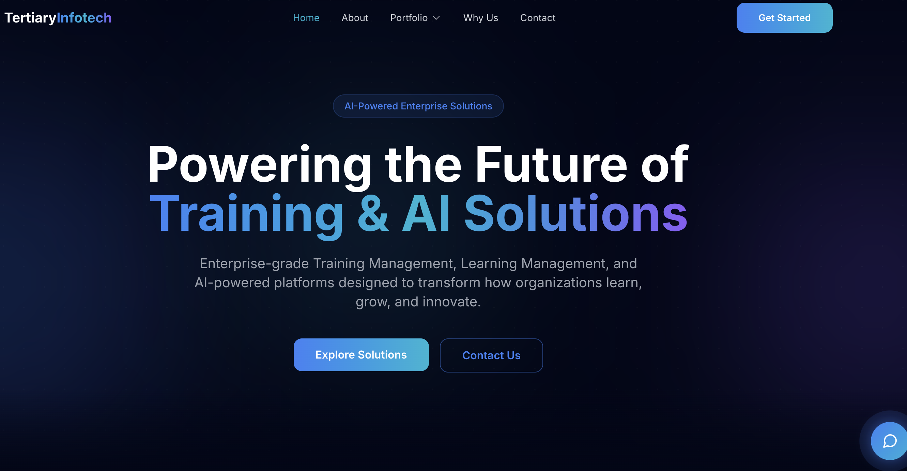

<div align="center">

# Tertiary Infotech Landing Page

[](https://react.dev)
[](https://vite.dev)
[](https://tailwindcss.com)
[](https://www.framer.com/motion/)
[](LICENSE)

**A high-tech, dark-themed landing page for an enterprise AI & training solutions company.**

[Report Bug](https://github.com/alfredang/tertiaryinfotech-landingpage/issues) · [Request Feature](https://github.com/alfredang/tertiaryinfotech-landingpage/issues)

</div>

---

## Screenshot



---

## About

**Tertiary Infotech** is a premium enterprise software company specializing in Training Management Systems (TMS), Learning Management Systems (LMS), and AI-Powered Solutions. This landing page showcases their portfolio with a futuristic dark-themed design inspired by Vercel, OpenAI, and Stripe.

### Key Features

- **Dark theme** with neon blue / cyan / purple accent highlights
- **Glassmorphism cards** with backdrop blur and glow effects
- **Animated gradient background** with floating orbs in the hero section
- **Portfolio dropdown banner** in the navigation bar
- **AI chatbot bubble** with popup chat window and simulated responses
- **Contact form** with client-side validation and success state
- **Scroll-triggered reveal animations** powered by Framer Motion
- **Responsive mobile menu** with accordion for portfolio items
- **Mobile-first design** — fully responsive across all breakpoints

---

## Tech Stack

| Category | Technology |
|----------|-----------|
| **Frontend** | React 19, JSX |
| **Build Tool** | Vite 7 |
| **Styling** | Tailwind CSS 3.4 |
| **Animation** | Framer Motion 12 |
| **Icons** | React Icons (Heroicons 2, Font Awesome) |
| **Navigation** | react-scroll (smooth scrolling) |
| **Language** | JavaScript (ES6+) |

---

## Architecture

```
┌─────────────────────────────────────────────┐
│                   Browser                    │
├─────────────────────────────────────────────┤
│              React 19 + Vite 7              │
├──────────┬──────────┬───────────────────────┤
│  Layout  │ Sections │     UI Components     │
│  ------  │ -------- │     -------------     │
│  Navbar  │  Hero    │  GlassCard            │
│  Mobile  │  About   │  GlowButton           │
│  Menu    │  Servic  │  ServiceCard          │
│  Footer  │  WhyUs   │  ScrollReveal         │
│          │  Contact │  ChatBot              │
├──────────┴──────────┴───────────────────────┤
│          Tailwind CSS + Framer Motion       │
├─────────────────────────────────────────────┤
│   Hooks: useScrollPosition, useFormValid.   │
│   Utils: constants, animations              │
└─────────────────────────────────────────────┘
```

---

## Project Structure

```
tertiaryinfotech-landingpage/
├── index.html                          # Entry HTML with meta tags & fonts
├── package.json                        # Dependencies & scripts
├── tailwind.config.js                  # Custom colors, shadows, animations
├── postcss.config.js                   # PostCSS with Tailwind
├── vite.config.js                      # Vite configuration
├── public/
│   └── favicon.svg                     # Gradient favicon
└── src/
    ├── main.jsx                        # React entry point
    ├── App.jsx                         # Root component orchestrator
    ├── index.css                       # Tailwind directives & global styles
    ├── components/
    │   ├── layout/
    │   │   ├── Navbar.jsx              # Sticky nav with portfolio dropdown
    │   │   ├── MobileMenu.jsx          # Full-screen slide-in menu
    │   │   ├── Footer.jsx              # 4-column footer
    │   │   └── Container.jsx           # Max-width wrapper
    │   ├── sections/
    │   │   ├── HeroSection.jsx         # Animated hero with gradient orbs
    │   │   ├── AboutSection.jsx        # Company intro with stat cards
    │   │   ├── ServicesSection.jsx      # TMS, LMS, AI service cards
    │   │   ├── WhyChooseUs.jsx         # 6-item feature grid
    │   │   └── ContactSection.jsx      # Glassmorphism contact form
    │   └── ui/
    │       ├── AnimatedBackground.jsx  # Floating gradient orbs
    │       ├── ChatBot.jsx             # AI chatbot bubble & popup
    │       ├── FeatureItem.jsx         # Why Choose Us grid item
    │       ├── GlassCard.jsx           # Glassmorphism card
    │       ├── GlowButton.jsx          # Glowing CTA button
    │       ├── ScrollReveal.jsx        # Scroll-triggered animation
    │       ├── SectionHeading.jsx      # Section title with gradient
    │       └── ServiceCard.jsx         # Service card with hover glow
    ├── hooks/
    │   ├── useScrollPosition.js        # Navbar background on scroll
    │   └── useFormValidation.js        # Form state & validation
    └── utils/
        ├── animations.js              # Framer Motion variant factories
        └── constants.js               # Nav links, services, features data
```

---

## Getting Started

### Prerequisites

- **Node.js** 18+ and **npm** 9+

### Installation

```bash
# Clone the repository
git clone https://github.com/alfredang/tertiaryinfotech-landingpage.git

# Navigate to the project
cd tertiaryinfotech-landingpage

# Install dependencies
npm install
```

### Running Locally

```bash
npm run dev
```

Open [http://localhost:5173](http://localhost:5173) in your browser.

### Production Build

```bash
# Build for production
npm run build

# Preview the production build
npm run preview
```

---

## Deployment

### Vercel (Recommended)

```bash
npx vercel
```

### Netlify

```bash
npm run build
# Deploy the dist/ folder
```

### Docker

```dockerfile
FROM node:18-alpine AS build
WORKDIR /app
COPY package*.json ./
RUN npm ci
COPY . .
RUN npm run build

FROM nginx:alpine
COPY --from=build /app/dist /usr/share/nginx/html
EXPOSE 80
CMD ["nginx", "-g", "daemon off;"]
```

```bash
docker build -t tertiaryinfotech-landing .
docker run -p 8080:80 tertiaryinfotech-landing
```

---

## Contributing

Contributions are welcome!

1. Fork the repository
2. Create your feature branch (`git checkout -b feature/amazing-feature`)
3. Commit your changes (`git commit -m 'feat: add amazing feature'`)
4. Push to the branch (`git push origin feature/amazing-feature`)
5. Open a Pull Request

For major changes, please open an [issue](https://github.com/alfredang/tertiaryinfotech-landingpage/issues) first to discuss what you'd like to change.

---

## Developed By

**Tertiary Infotech Academy Pte. Ltd.**

---

## Acknowledgements

- [React](https://react.dev) — UI library
- [Vite](https://vite.dev) — Build tool
- [Tailwind CSS](https://tailwindcss.com) — Utility-first CSS framework
- [Framer Motion](https://www.framer.com/motion/) — Animation library
- [React Icons](https://react-icons.github.io/react-icons/) — Icon library
- [react-scroll](https://github.com/fisshy/react-scroll) — Smooth scrolling

---

<div align="center">

**If you found this useful, please consider giving it a ⭐**

</div>
